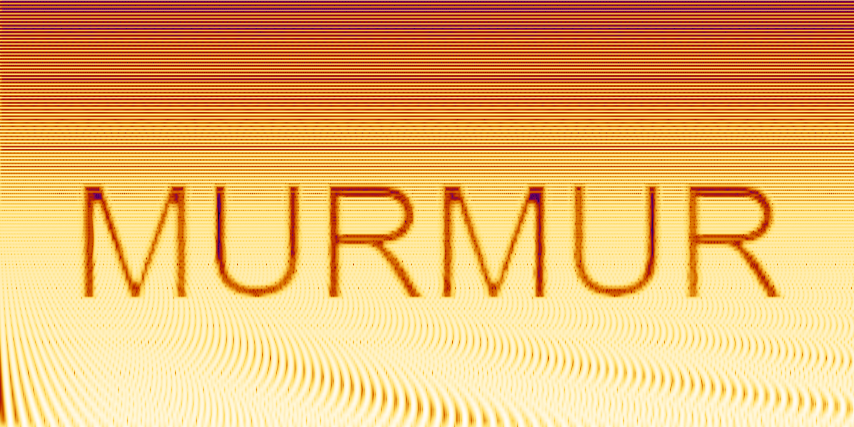
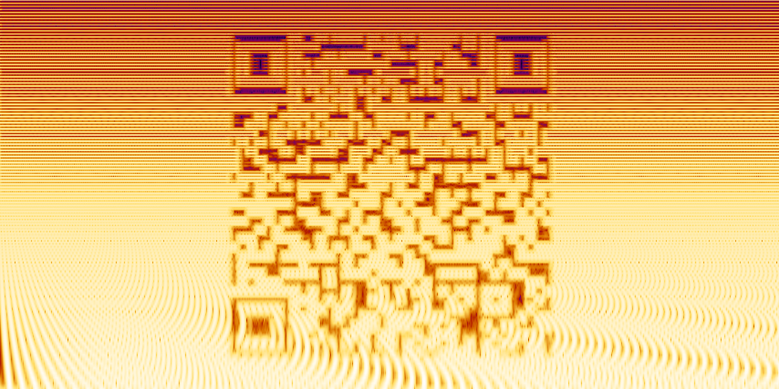
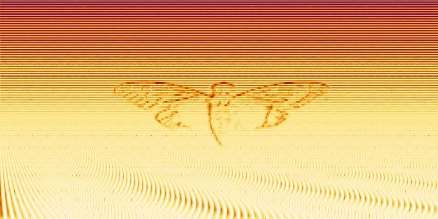
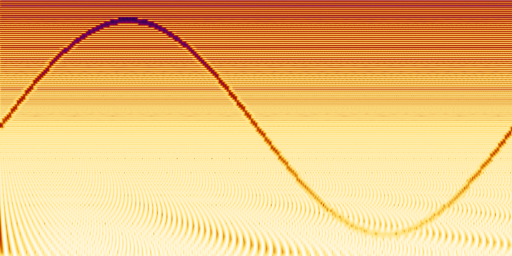
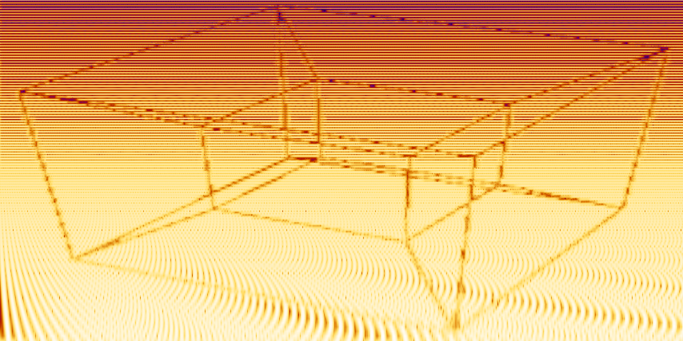
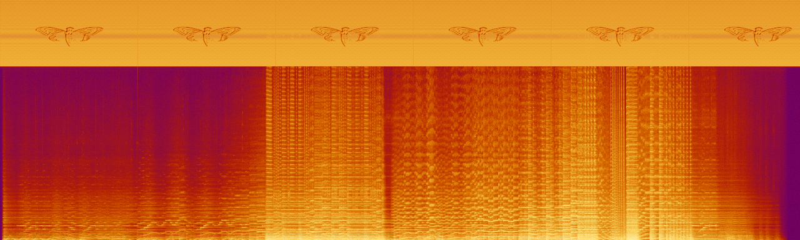

# Murmur

**Hide images inside audio. Reveal them in the spectrogram.**

Murmur is a command-line steganography tool that encodes images, text, QR codes, and other visuals
into the frequency domain of audio files. To any listener it is just sound, open it in a
spectrogram viewer and the hidden content appears.

---

## Gallery

**Text**, encode any string directly into the waveform:

<p align="center">
  
</p>

```bash
murmur encode --text "MURMUR" --output pocs/poc_text.wav --verify-after-encode
```

**QR code**, scannable from the spectrogram image:

<p align="center">
  
</p>

```bash
murmur encode --qr "https://github.com/ZakiPedio/Murmur" --output pocs/poc_qr.wav --verify-after-encode
```

**Image**, the Cicada 3301 logo encoded into audio:

<p align="center">
  
</p>

```bash
murmur encode --image pocs/assets/cicada-3301.png --auto-contrast --output pocs/poc_cicada.wav --verify-after-encode
```

**Math**, plot any expression; this is `sin(x)` from 0 to 2π:

<p align="center">
  
</p>

```bash
murmur encode --math "sin(x)" --x-range=0:6.28 --output pocs/poc_math.wav --verify-after-encode
```

**4D projection**, the tesseract wireframe hidden in sound:

<p align="center">
  
</p>

```bash
murmur encode --image pocs/assets/TesseractProjection.png --auto-contrast --output pocs/poc_tesseract.wav --verify-after-encode
```

**Overlay**, Cicada 3301 hidden inside Swan Lake at 16–22 kHz, completely inaudible:

<p align="center">
  
</p>

```bash
murmur overlay --image pocs/assets/cicada-3301.png --auto-contrast \
    --carrier "Swan Lake Suite, Op. 20 I. Scene 1 - Royal Philharmonic Orchestra.wav" \
    --freq-min 16000 --freq-max 22000 --blend 0.2 --randomize-phase --repeat \
    --output pocs/poc_overlay.wav
murmur verify --input pocs/poc_overlay.wav --output pocs/poc_overlay.spec.png \
    --freq-min 200 --freq-max 22000 --width 1280 --height 384
```

> The bottom band is Swan Lake's orchestral content. The top strip (16–22 kHz) contains the
> hidden image, sitting above human hearing sensitivity.

---

## Installation

**Requirements:** Python 3.10+, numpy, Pillow, qrcode

```bash
git clone https://github.com/ZakiPedio/Murmur.git
cd Murmur
python -m venv .venv

# Windows
.venv\Scripts\activate
# macOS / Linux
source .venv/bin/activate

pip install .
```

Optional extras:

```bash
pip install ".[svg,decode]"   # SVG input + QR auto-extraction
```

For non-WAV output (MP3, FLAC, OGG):

```bash
# Windows:  winget install ffmpeg
# macOS:    brew install ffmpeg
# Linux:    sudo apt install ffmpeg
```

---

## Quick Start

```bash
# Encode text into audio and immediately preview the spectrogram
murmur encode --text "HELLO WORLD" --output hello.wav --verify-after-encode

# Encode an image
murmur encode --image logo.png --output logo.wav

# Encode a QR code (stealth preset: near-inaudible 14–20 kHz band)
murmur encode --qr "https://example.com" --preset cicada --output qr.wav

# Plot a math expression
murmur encode --math "sin(x)" --x-range=0:6.28 --output sine.wav

# Analyze a carrier before overlaying, get freq range and blend recommendations
murmur probe --input music.wav

# Embed an image into existing audio at a specific frequency band
murmur overlay --image logo.png --carrier music.wav \
    --freq-min 16000 --freq-max 22000 --blend 0.2 \
    --randomize-phase --repeat --output result.wav

# Verify / extract the spectrogram from any audio file
murmur verify --input result.wav --output spec.png
```

---

## Features

- **Encode** images, text, ASCII art, QR codes, SVG, math expressions, GIFs, and image sequences
- **Overlay** encoded data into any existing audio file at a chosen frequency band, time offset, and blend level
- **Probe** a carrier file for octave-band RMS analysis and automatic freq/blend recommendations
- **Decode** QR codes directly from audio spectrograms (requires pyzbar)
- **Verify** any audio file by generating a spectrogram PNG instantly
- Six **named presets**: `aphex`, `cicada`, `stealth`, `loud`, `watermark`, `musical`
- Three **dithering** algorithms: Floyd-Steinberg, ordered (Bayer 4×4), threshold
- **Stereo channel** targeting, encode different images into left and right independently
- **Log or linear** frequency axis mapping
- **Auto-contrast** stretching for faint or washed-out source images
- **Randomized phase** synthesis, sounds like band-limited noise instead of a tonal buzz
- **MP3-safe mode**, clamps freq range to survive lossy re-encoding
- **Tiling**, repeat the image N times across the audio duration
- **Watermark mode**, spread the signal invisibly across the full carrier duration
- Three spectrogram **colourmaps**: inferno, grayscale, viridis
- Pure Python: numpy + Pillow + stdlib `wave`, no scipy, librosa, or matplotlib

---

## Presets

| Preset | Freq Range | Duration | Notes |
|--------|-----------|----------|-------|
| `aphex` | 200–12000 Hz | 8 s | Full audible range; classic face-in-spectrogram style |
| `cicada` | 14000–20000 Hz | 15 s | Near-inaudible; QR code in stealth band |
| `stealth` | 16000–20000 Hz | 30 s | Ultra-quiet; blend 0.05; hardest to detect |
| `loud` | 100–16000 Hz | 5 s | Maximum contrast; linear frequency scale |
| `watermark` | 8000–19000 Hz | carrier | Forensic; blend 0.03; spread across full duration |
| `musical` | 500–4000 Hz | 10 s | Mid-range; blends most naturally with music |

```bash
murmur presets          # list all presets
murmur encode --text "MURMUR" --preset aphex --output aphex.wav
```

---

## How It Works

Murmur uses **additive sine synthesis**: each row of the input image is assigned a frequency
between `--freq-min` and `--freq-max` (logarithmically spaced by default), and each column
becomes a time frame. Pixel brightness controls the amplitude of the corresponding sine wave.
All sine waves for a frame are summed in one vectorized numpy operation, windowed with a 50%
overlap Hann window, and written as a standard WAV file.

The result is audio whose spectrogram is your image, not a watermark, not metadata, but the
signal itself.

---

## Documentation

Full reference for all subcommands, flags, and advanced techniques: **[DOCS.md](DOCS.md)**

---

## License

GNU General Public License v3.0 or later, see [LICENSE](LICENSE) for the full text.
